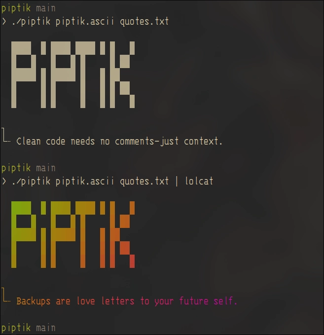

**PIPTIK**

Have fun with terminal

Create a simple ASCII art file and a simple quote text file (one quote per line),  
then run the program as in the example below.

**Examples:**

```sh
./piptik /path/to/art.ascii /path/to/quotes.txt
./piptik /path/to/art.ascii /path/to/quotes.txt | lolcat
```
Add to your .bashrc 


